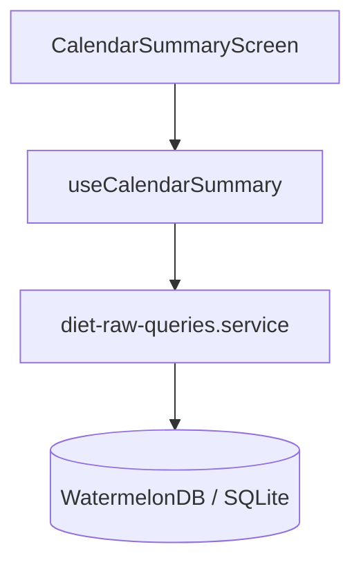

# Technical Design Spec - Diet History (Consistency Dashboard)

* **Feature Name:** Diet History Redesign
* **Slug:** `01/07/26-diet-history`
* **Target Directory:** `specs/01/07/26-diet-history/`
* **Author:** Jacques (Developer) / Antigravity (AI Assistant)

---

## 1. System Architecture

The diet history functionality will follow a modular feature-first architecture (`02-architecture-data.md`), reusing the existing SQLite WatermelonDB schema.



### 1.1. Data Models
We consume the existing database tables:
1. **`meals`:** Parent record. Contains `id` and `target_date` (format: `YYYY-MM-DD`).
2. **`meal_items`:** Joining record. Contains `meal_id`, `food_id`, and `quantity` (weight in grams).
3. **`foods`:** Nutritional records. Contains `id`, `calories`, `protein`, `carbohydrates`, and `fat`.

---

## 2. Database Queries & Optimization

To prevent performance degradation (N+1 queries) when fetching months of historical diet records, we will implement a Raw SQL aggregation query inside `src/features/diet/services/diet-raw-queries.service.ts` using `database.adapter.query`.

### 2.1. Aggregated SQLite Query
This query joins `meals`, `meal_items`, and `foods` to compute daily calorie totals, macronutrient sums, and meal counts in a single pass:
```sql
SELECT 
  m.target_date as date,
  COUNT(distinct m.id) as mealCount,
  SUM(f.calories * mi.quantity / 100.0) as calories,
  SUM(f.protein * mi.quantity / 100.0) as protein,
  SUM(f.carbohydrates * mi.quantity / 100.0) as carbs,
  SUM(f.fat * mi.quantity / 100.0) as fat
FROM meals m
LEFT JOIN meal_items mi ON mi.meal_id = m.id
LEFT JOIN foods f ON f.id = mi.food_id
WHERE m.target_date IS NOT NULL
GROUP BY m.target_date
ORDER BY m.target_date DESC
```

### 2.2. Service Integration
* The service will expose a function `fetchDailySummaries(): Promise<DailySummary[]>` where `DailySummary` is defined as:
```typescript
export interface DailySummary {
  date: string;       // YYYY-MM-DD
  mealCount: number;
  calories: number;
  protein: number;
  carbs: number;
  fat: number;
}
```

---

## 3. UI/UX Component Hierarchy & Layout

### 3.1. CalendarSummaryScreen Component Flow
1. **Loading State:** Render 4 skeleton placeholder cards with a shimmer/pulse animation using `bg-surface-elevated animate-pulse` to prevent CLS.
2. **Empty State:** Render the shared `<EmptyState>` molecule if no meals are logged.
3. **Main Content:** A `FlatList` component containing:
   * **`ListHeaderComponent`:** Consistency Heatmap card.
     * Horizontal scrollable grid of the last 28 days.
     * Grid weekday headers (`D`, `S`, `T`, `Q`, `Q`, `S`, `S`).
     * Circular dots colored based on compliance with ±100 kcal margin of target (2200 kcal).
     * Color Legend underneath the grid.
   * **`renderItem`:** Grouped cards.
     * Section headers separating entries by Month/Year (e.g. `JULHO DE 2026`) displaying:
       * Average monthly calories.
       * Compliance percentage rate.
     * Daily summary list rendering `<DailySummaryCard>` components.

### 3.2. DailySummaryCard Enhancements
* **Accessibility:**
  * Uses `accessibilityRole="button"`.
  * Computes descriptive `accessibilityLabel` combining date, calorie progress, macro amounts, and goal status.
* **Layout Grid:** Uses a 4-column layout (`px-screen-x`, `gap-grid-gutter`).
* **Visual Components:**
  * Displays a semantic progress bar utilizing the `<Progress>` primitive styled via tailwind class names:
    * Under/Over: `bg-warning`
    * Exceeded: `bg-error`
    * Met: `bg-success`
  * Displays macro badges showing grams in `font-mono` text.

---

## 4. Spacing & Styling System Integration (Tailwind v4)
* Outer padding: `p-screen-x` (from tailwind config).
* Gap between cards: `gap-content-gap`.
* Surface coloring: `bg-surface` for list, `bg-surface-elevated` for cards and headers.
* Borders: `border border-border-subtle`.
* Typography: Standard `<Text>` wrapper component with variants (`title`, `subtitle`, `caption`). Tabular numbers styled with `font-mono`.
