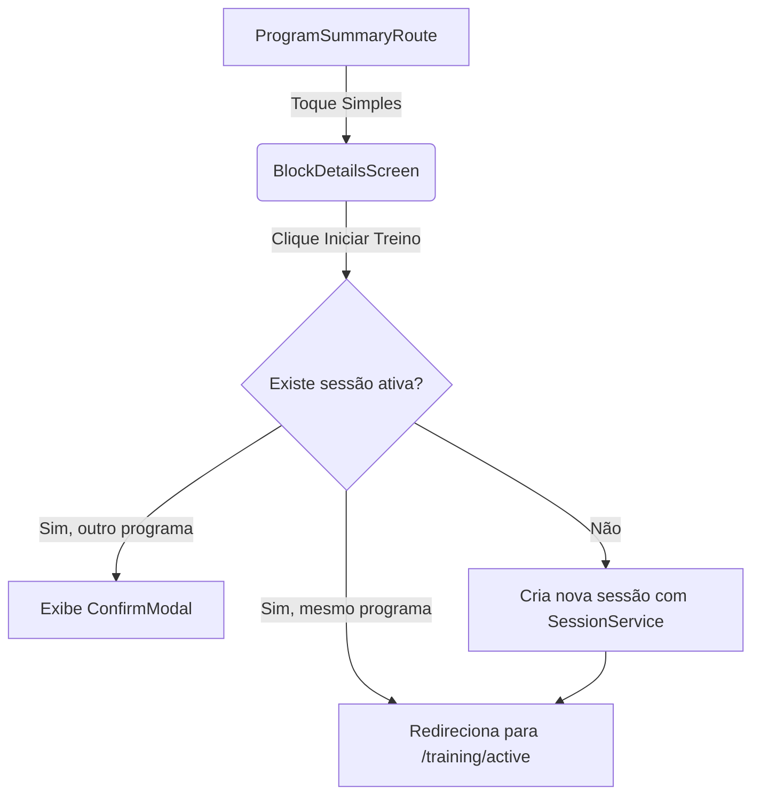

# Design Técnico: Início de Treino por Botão

## 1. Modificações nos Componentes e Telas

### A. `WorkoutListItem.tsx` (`src/features/training/components/WorkoutListItem.tsx`)
- **Remoção de Código**:
  - Remover o import de `ReanimatedSwipeable`.
  - Remover a propriedade `onStartSession` da interface.
  - Eliminar o componente `LeftAction` e a função `renderLeftActions`.
  - Retornar o JSX `content` diretamente na raiz do componente (em vez de encapsulado em `ReanimatedSwipeable`), mantendo apenas a borda de arredondamento dinâmica (`rounded-t-xl` / `rounded-b-xl`).

### B. `BlockDetailsScreen.tsx` (`src/features/training/components/BlockDetailsScreen.tsx`)
- **Importações Adicionadas**:
  - `ConfirmModal` de `@/components/organisms/ConfirmModal`.
  - `SessionService` de `@/features/training/services/session-service`.
  - `useCallback` e `useState` do React.
- **Estruturação do Layout**:
  - Alterar o elemento raiz para uma `View` com classe `flex-1 justify-between`.
  - Envolver a listagem atual em um `<ScrollView className="flex-1 px-4 py-2" ...>`.
  - Adicionar um `<View className="px-4 pb-content-bottom">` fixo no rodapé.
  - Renderizar dentro dele o `<Button className="min-h-control-lg bg-primary rounded-md" onPress={handleStartSession}>Iniciar Treino</Button>`.
- **Lógica e Estado**:
  - Adicionar estado `activeSession` (para sessão em andamento).
  - Adicionar estado `activeSessionConfirmVisible` (booleano).
  - Adicionar a função `checkActiveSession` para buscar a sessão atual do banco.
  - Adicionar o método `handleStartSession` para gerenciar a criação da sessão e redirecionamento de rotas (copiado de `app/training/program/[id].tsx`).
  - Renderizar o `ConfirmModal` na base da tela para confirmações de sessão cruzada de outro programa.

### C. `ProgramSummaryRoute` (`app/training/program/[id].tsx`)
- **Limpeza**:
  - Remover as referências obsoletas ao fluxo de swipe e `handleStartSession`, já que não há mais ação de início direto na listagem desta página.
  - Remover a lógica de verificação de sessão ativa `activeSession` e o `ConfirmModal` desta tela, já que foi movido para os detalhes do treino.

## 2. Diagrama de Fluxo de Navegação

