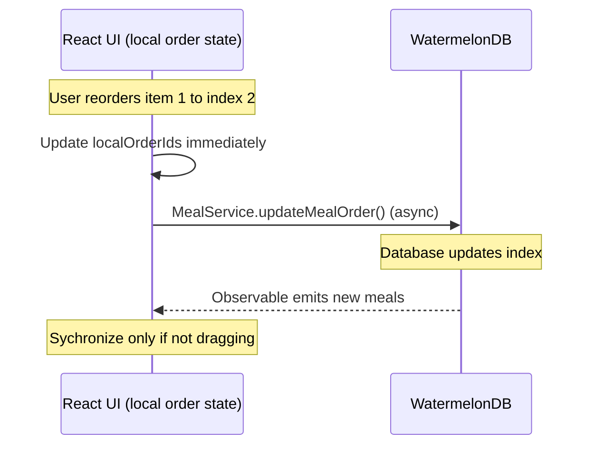

# Technical Design: Diet Meal Drag & Drop

## Overview
To provide a smooth reordering experience for daily meals on the menu screen, we are shifting from the animation-based spring transitions to a direct, visual-only positioning model. We will eliminate morphia switching in `MealCard.tsx` (the card will remain expanded/populated at all times) and handle layout reordering using custom gesture positioning inside a `ScrollView`.

## Architectural Layout
We are utilizing React Native Gesture Handler and React Native Reanimated to intercept long presses and drag gestures. The parent `ScrollView` scroll capability is toggled based on the dragging state.

```mermaid
graph TD
    ScrollView[ScrollView] --> GestureHandlerRootView[GestureHandlerRootView]
    GestureHandlerRootView --> DraggableMealItem[DraggableMealItem]
    DraggableMealItem --> GestureDetector[GestureDetector]
    GestureDetector --> MealCard[MealCard (Full Morphia)]
```

## Detailed Changes

### 1. Morphia Retention (`MealCard.tsx`)
- Simplify `MealCard.tsx` by removing the `isReordering` boolean prop and conditional rendering.
- The card will always render in its full form, showing its name, carbohydrate/protein/fat macros, food items, and action buttons.
- Remove outdated layout parameters.

### 2. Gesture Controller & Animation Removal (`MenuScreen.tsx`)
- Maintain a local state `mealOrderIds` in `MenuScreenComponent` to manage the list ordering synchronously.
- When `activeId.value !== null` (a drag is active), the items are positioned using `position: 'absolute'` and a `translateY` offset based on their heights.
- All spring animations (`withSpring`) are removed to avoid visual sliding delays or slow-motion jumps:
  - During drag, translation updates are immediate.
  - On drop, the item is fixed to its new coordinate immediately.
- A wrapper function is executed on the JS thread (`runOnJS`) to trigger haptic feedback (`expo-haptics`) and update the local `mealOrderIds` state right before setting `activeId.value = null`, eliminating the 5ms flicker where the layout would briefly fall back to the old database ordering.

## Data Layer Semic-Lock
The local React ordering is synchronized from the database observable *only* when no drag operation is running or pending. This acts as a visual latch while database batch operations complete.



## Security, Maintainability & Scalability (Core Pillars)
- **Security:** Safe batch writes are handled within transaction blocks in WatermelonDB. No private data is logged.
- **Maintainability:** Redundant layout animations and layout modes are purged, leaving a clean component interface.
- **Scalability:** Computational complexity for the reorder logic is $O(N)$ where $N$ is the number of meals (usually $< 10$).
