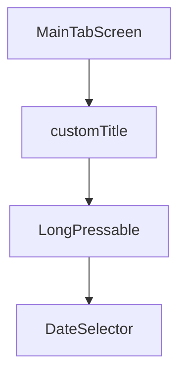

# Technical Design: Header Long Press Reorder

## Overview
We will wrap the header's central title component (`DateSelector`) in `LongPressable`. The wrapper will trigger the pre-existing `startReorder` callback upon receiving a long press gesture.

## Detailed Changes

### 1. Component Wrapping (`MenuScreen.tsx`)
- Import `LongPressable` from `@/components/ui/long-pressable`.
- Update `customTitle` property of `MainTabScreen` to wrap the `<DateSelector />` component inside `<LongPressable onLongPress={startReorder}>`.

## Security, Maintainability & Scalability (Core Pillars)
- **Security:** No security impact. Input gestures are local and validated.
- **Maintainability:** Using the established custom `LongPressable` wrapper preserves haptic feedback defaults without duplicating code.
- **Scalability:** Zero overhead.
