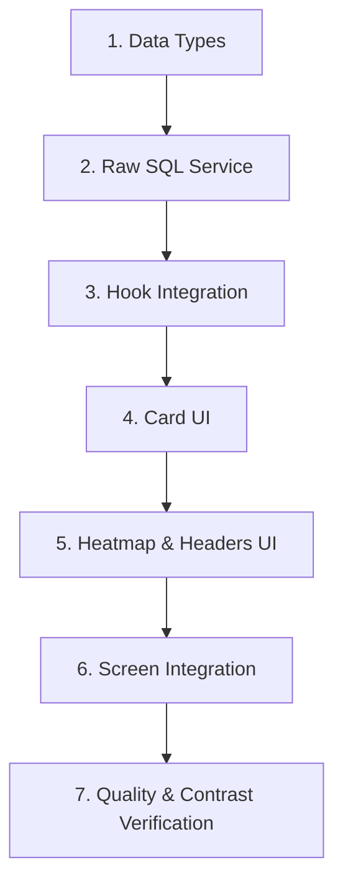

# Task Breakdown - Diet History Redesign

* **Feature Name:** Diet History Redesign
* **Slug:** `01/07/26-diet-history`
* **Target Directory:** `specs/01/07/26-diet-history/`
* **Author:** Jacques (Developer) / Antigravity (AI Assistant)

---

## Technical Dependency Flow

---

## 1. Data Layer & Business Logic

- [x] **Task 1.1: Define Data Types**
  - **File:** `src/features/diet/types.ts`
  - **Action:** Define the `DailySummary` interface containing `date`, `mealCount`, `calories`, `protein`, `carbs`, and `fat` attributes.
  - **Skill:** `frontend-developer`
  - **Estimated Time:** 3 mins

- [x] **Task 1.2: Implement SQL Raw Query Service**
  - **File:** [diet-raw-queries.service.ts](file:///c:/Programmer/fitApp/src/features/diet/services/diet-raw-queries.service.ts)
  - **Action:** Implement `fetchDailySummaries()` executing the optimized SQLite `JOIN` query on `meals`, `meal_items`, and `foods` via `database.adapter.query`.
  - **Skill:** `backend-architect`
  - **Estimated Time:** 5 mins

- [x] **Task 1.3: Update Hook to Use Raw Query Service**
  - **File:** [useCalendarSummary.ts](file:///c:/Programmer/fitApp/src/features/diet/hooks/useCalendarSummary.ts)
  - **Action:** Replace internal database query loops with a call to `diet-raw-queries.service.ts`.
  - **Skill:** `react-state-management`
  - **Estimated Time:** 5 mins

---

## 2. Card UI Component

- [x] **Task 2.1: Implement Calorie Target Matching Logic**
  - **File:** [DailySummaryCard.tsx](file:///c:/Programmer/fitApp/src/components/molecules/DailySummaryCard.tsx)
  - **Action:** Add helper calculations evaluating current daily calories against goal (2200 kcal) inside a ±100 kcal target range.
  - **Skill:** `frontend-developer`
  - **Estimated Time:** 3 mins

- [x] **Task 2.2: Add Horizontal Progress Bar**
  - **File:** [DailySummaryCard.tsx](file:///c:/Programmer/fitApp/src/components/molecules/DailySummaryCard.tsx)
  - **Action:** Integrate FitApp's semantic `<Progress>` component representing daily calorie fill rate.
  - **Skill:** `react-ui-patterns`
  - **Estimated Time:** 4 mins

- [x] **Task 2.3: Implement Semantic Compliance Badges**
  - **File:** [DailySummaryCard.tsx](file:///c:/Programmer/fitApp/src/components/molecules/DailySummaryCard.tsx)
  - **Action:** Render a text status badge styled with only semantic variables:
    * Meta Batida: `text-success bg-success/10 border-success/30`
    * Próximo: `text-warning bg-warning/10 border-warning/30`
    * Desvio: `text-error bg-error/10 border-error/30`
  - **Skill:** `frontend-design`
  - **Estimated Time:** 4 mins

- [x] **Task 2.4: Integrate Accessibility Rótulos & Touch Targets**
  - **File:** [DailySummaryCard.tsx](file:///c:/Programmer/fitApp/src/components/molecules/DailySummaryCard.tsx)
  - **Action:** Ensure touch target height is at least 44px (`min-h-touch-target`). Define custom `accessibilityRole="button"` and a descriptive `accessibilityLabel` containing all summary info.
  - **Skill:** `ui-ux-pro-max` (a11y guidelines)
  - **Estimated Time:** 3 mins

---

## 3. History Screen & Grouping UI

- [x] **Task 3.1: Group Daily Summaries by Month/Year**
  - **File:** [CalendarSummaryScreen.tsx](file:///c:/Programmer/fitApp/src/features/diet/components/CalendarSummaryScreen.tsx)
  - **Action:** Write JS grouping function that splits summaries into monthly arrays and computes monthly average calories and compliance rates.
  - **Skill:** `frontend-developer`
  - **Estimated Time:** 5 mins

- [x] **Task 3.2: Implement Shimmer Skeleton Loader**
  - **File:** [CalendarSummaryScreen.tsx](file:///c:/Programmer/fitApp/src/features/diet/components/CalendarSummaryScreen.tsx)
  - **Action:** Replace the default `ActivityIndicator` loading spinner with a custom shimmer screen containing pulsating empty card shapes.
  - **Skill:** `ui-ux-pro-max` (CLS mitigation)
  - **Estimated Time:** 5 mins

- [x] **Task 3.3: Implement Consistency Heatmap Grid**
  - **File:** [CalendarSummaryScreen.tsx](file:///c:/Programmer/fitApp/src/features/diet/components/CalendarSummaryScreen.tsx)
  - **Action:** Render the last 28 days of compliance in a 7-column grid as a `ListHeaderComponent`. Color-code dots dynamically based on target compliance using design system tokens.
  - **Skill:** `frontend-design`
  - **Estimated Time:** 5 mins

- [x] **Task 3.4: Add Heatmap Legend & Month Headers**
  - **File:** [CalendarSummaryScreen.tsx](file:///c:/Programmer/fitApp/src/features/diet/components/CalendarSummaryScreen.tsx)
  - **Action:** Render a small dot legend at the bottom of the heatmap and style the dynamic monthly headers with calculated calorie averages.
  - **Skill:** `frontend-developer`
  - **Estimated Time:** 4 mins

---

## 4. Verification

- [x] **Task 4.1: Run Automated Tests**
  - **Action:** Execute `npm run test` and check for any db, hook, or component syntax regressions.
  - **Skill:** `backend-architect`
  - **Estimated Time:** 3 mins

- [x] **Task 4.2: Contrast and Usability Quality Audit**
  - **Action:** Verify light/dark theme contrast. Test Navigation routing to correct dates back on the main Diet tab.
  - **Skill:** `ui-ux-pro-max`
  - **Estimated Time:** 5 mins
