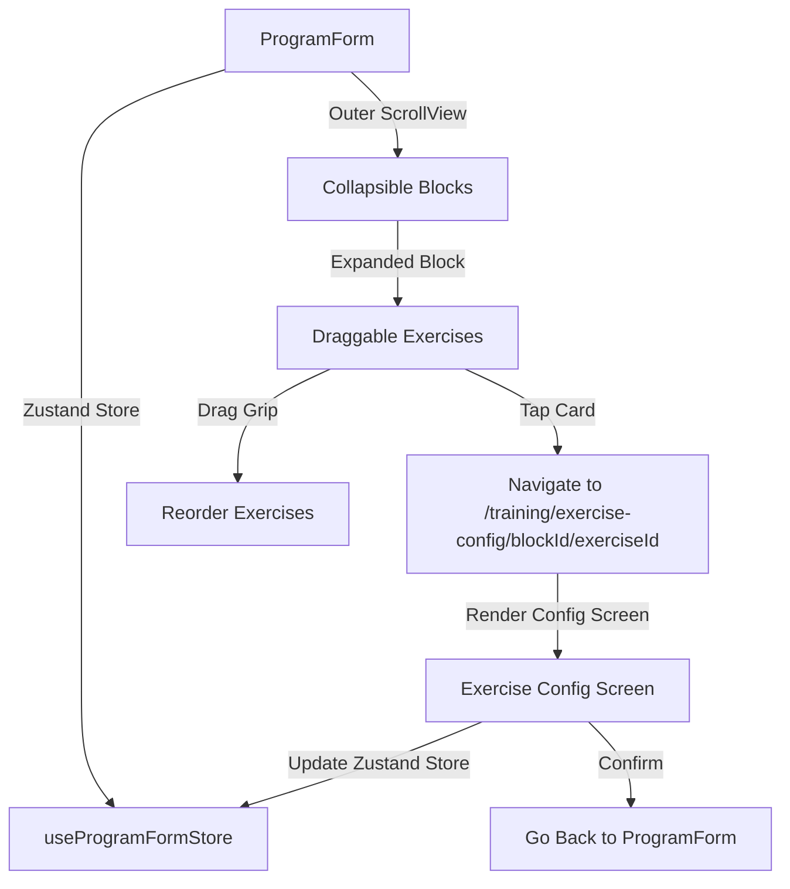

# Phase 2: Technical Design

## Overview
This design centralizes program editing within the `ProgramForm` screen and removes the horizontal Kanban editor entirely. It updates the `ProgramForm` interface to use collapsible cards for training blocks (workouts) and draggable list cards for exercises. Exercise settings (sets, reps, RIR, advanced technique) are moved into a dedicated overlay dialog (progressive disclosure) that opens when tapping an exercise card.

## Architecture & Navigation
1. **Remove Kanban Files**: Delete `ProgramKanbanEditor.tsx` and `WorkoutColumnEditor.tsx`.
2. **Update ProgramSummaryScreen**: Remove the "Visualizar Kanban" toggle and any reference to Kanban view.
3. **Refactor ProgramForm**:
   - The screen hosting the form (`create-program.tsx` and `edit-program/[id].tsx`) will use `<Screen scrollable={false}>` to avoid scroll conflicts.
   - `ProgramForm` will render its own `ScrollView` with `scrollEnabled` state to lock/unlock outer scroll during exercise drag-and-drop.
   - Blocks (workouts) are rendered as collapsible card components.
   - Exercises are rendered inside each block as clean, compact draggable cards.
   - A single reusable `Dialog` (modal) in `ProgramForm` is used to configure exercise details.

## Detailed Component Specifications

### 1. Collapsible Block Card
- **Header**:
  - Text input for Block Name.
  - Expand/Collapse toggle button (chevron icon).
  - Delete Block button (trash icon).
- **Body** (only visible when `isExpanded` is true):
  - Lists the exercises for this block.
  - "Adicionar exercício" button at the bottom.

### 2. Draggable Exercise Card
- **Layout**: Row container with border.
- **Left**: Grip vertical icon acting as drag handle.
- **Center**: Exercise name and a subtitle summarizing current configs (e.g. `3 sets x 8-12 reps • RIR: 2`).
- **Right**: Delete button.
- **Interaction**:
  - Tapping the card routes to the Exercise Configuration Screen.
  - Tapping the delete button removes the exercise from the block.

### 3. Exercise Configuration Screen (`app/training/exercise-config/[blockId]/[exerciseId].tsx`)
- Container using `<Screen scrollable={true}>` wrapping:
  - Dropdown (`ExerciseSelect`) for selecting the exercise.
  - Numeric inputs for: Sets, Reps Min, Reps Max, Reps in Reserve (RIR).
  - Text input for Advanced Technique.
  - A prominent "Confirmar" button at the bottom that saves modifications in the Zustand store and navigates back using `router.back()`.

## Data Models & Hooks
To persist the form state when navigating to and back from the configuration screen, we will introduce a Zustand store:
- `useProgramFormStore` (defined in `src/features/training/store/program-form-store.ts`) holding:
  - `programName`: string
  - `blocks`: BlockInput[]
  - `setProgramName`: (name: string) => void
  - `setBlocks`: (blocks: BlockInput[]) => void
  - `updateExercise`: (blockId: string, exerciseId: string, field: keyof ExerciseDTO, value: any) => void
- `useProgramForm` hook will read and write to this store instead of local `useState` variables.

## Spacing & Spacers (ui-ux-pro-max compliance)
- The outer container uses `px-screen-x py-4` for comfortable padding.
- Cards use `rounded-xl border border-border-subtle bg-surface` for consistent styling.
- Grip handles use a touch-target helper of at least 44pt.
- Color theme utilizes the blue-first Mineral Warm color palette.
