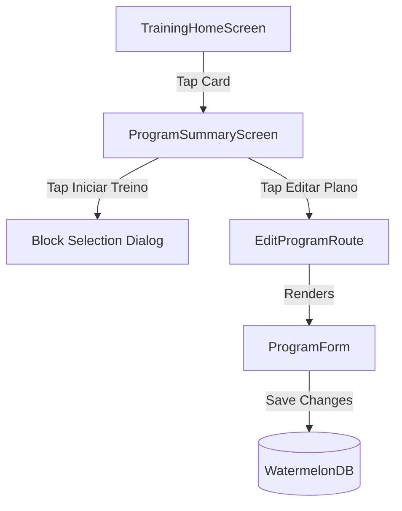

# Phase 2: Technical Design

## Overview
This design unifies the user flow for starting a workout and editing an existing workout program. The main entry point becomes the Program Summary screen, which provides a clear side-by-side action card for starting a workout session or editing the plan. The program creation form is refactored into a general-purpose creation/editing form.

## Architecture
- **Training HomeScreen**: Simple list of programs. Cards link directly to `/training/program/[id]`. No nested primary action buttons.
- **Program Details (`/training/program/[id]`)**: Displays a dashboard header card with the program name and two prominent CTA buttons: "Iniciar Treino" (primary, starts workout block select) and "Editar Plano" (secondary/outline, links to edit route).
- **Edit Program Screen (`/training/edit-program/[id]`)**: Hosts the `ProgramForm` component in edit mode by passing the `programId` parameter.
- **Form Controller (`useProgramForm`)**: Loads existing program data from database on mount, manages local state, and delegates the save action to `WorkoutService.updateProgram` if `programId` is present.

## Components and Interfaces
- **`ProgramCard`**: Spaced layout with `Pin` and `Trash` icons. The card itself is a `Pressable` linking to details.
- **`ProgramSummaryScreen`**: Incorporates the new bifurcation buttons. The "Iniciar Treino" button opens the `Dialog` (already declared in the screen) to choose a block.
- **`ProgramForm` & `useProgramForm`**: Refactored to accept an optional `programId` parameter. When set, uses `useEffect` to query program, training blocks, and exercises, mapping database records to `useProgramForm` inputs.

## Data Models
No database migrations are needed. We use WatermelonDB query relations and transaction writes:
- Fetch program blocks using `observeProgramBlocks` sorted by `order`.
- Fetch block exercises using `observeBlockExercises` sorted by `order`.
- Write updates to WatermelonDB in a transaction using `database.batch(...)` to prepare creations, updates, and marks as deleted:
  - If a block/exercise ID in form state is not in the database, it's created.
  - If a block/exercise ID in the database is not in the form state, it is marked as deleted.
  - Otherwise, the database record is updated with current form values.

## Error Handling & Feedback
- Validate inputs in `useProgramForm` before committing to DB. Show inline errors.
- Display `FeedbackDialog` for database save results (success or failure). On success, navigate back.
- Disabled buttons during saving to prevent double submission.

## Testing Strategy
- **Visual & Layout**: Verify tap targets are at least 44pt and have adequate padding. Check Mineral Warm color theme compliance in both light and dark modes.
- **Navigation**: Verify smooth transition to summary screen and edit screen, and proper back-stack behavior.
- **Database Consistency**: Verify that editing a program name, adding new blocks, removing blocks, adding new exercises, and editing sets/reps properly persists in SQLite. Verify that removed items are deleted from the database.
