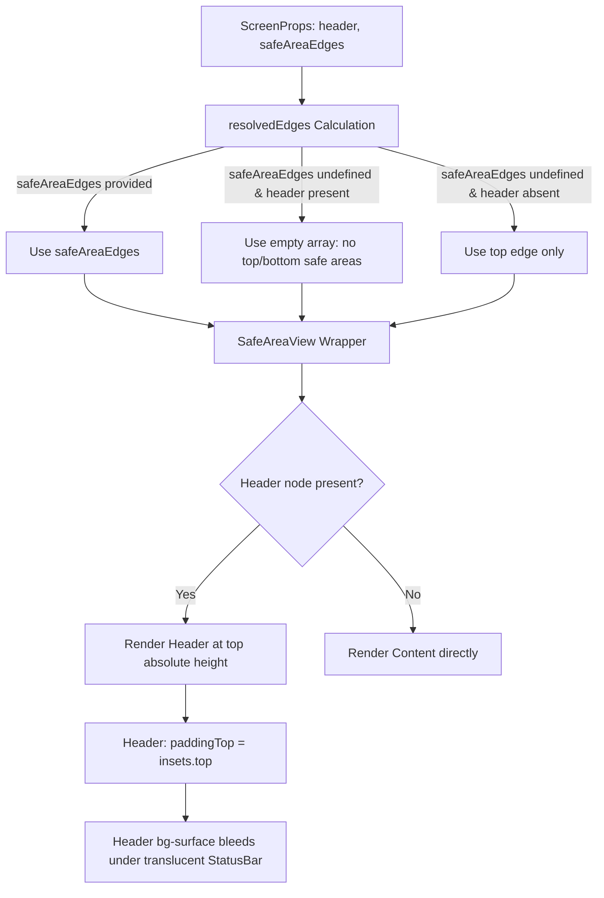

# Design: Screen Header and StatusBar Bug Fix

## Status
- **Date**: 2026-06-25
- **Slug**: `25-06-26-fix-screen-header-visual`

## 1. Architecture & Flow
The dynamic top safe area resolution avoids layout padding collision between `Screen` (the root wrapper) and `Header` (the molecule component).



## 2. Component Design Changes

### `src/components/ui/screen.tsx`
- Remove default `safeAreaEdges = ['top', 'bottom']` from parameters.
- Resolve the edges inside the component body:
  ```tsx
  const resolvedEdges = safeAreaEdges ?? (header ? [] : ['top']);
  ```
- Pass `resolvedEdges` to the `Wrapper` (`SafeAreaView` or `View`).
- Maintain background styling: the `Wrapper` has `bg-background`, but the `Header` component itself renders with `bg-surface`.
- Because `'top'` is omitted when a header is present, `Header` sits at `y=0` physically, and its internal `paddingTop: insets.top` offsets the content safely below the status bar/notch. This allows its `bg-surface` background to extend behind the translucent StatusBar.
- Because `'bottom'` is omitted by default, the page content (`ScrollView` or root `View`) extends all the way flush to the bottom tab bar (nav bar), avoiding any empty padding gap.
- Remove any vertical paddings or margins from the `Screen` wrapper content container to keep content flush.

## 3. Security, Maintainability & Scalability
- **Security:** No security implications (UI layout only).
- **Maintainability:** Pure declarative state resolution. No hardcoded heights or manual padding calculations are introduced. It honors existing safe area inset values.
- **Scalability:** High compatibility across various screen aspect ratios and notches on both iOS and Android.
